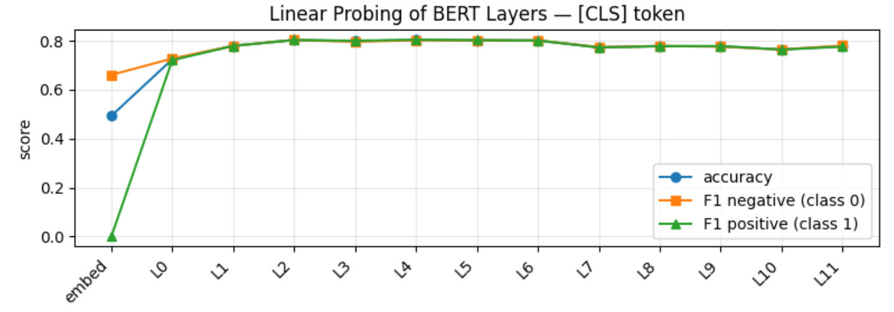
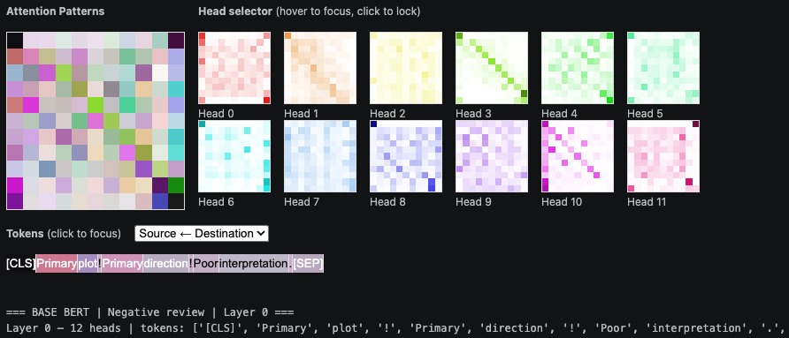
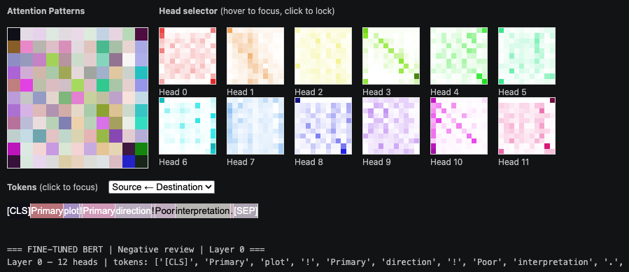
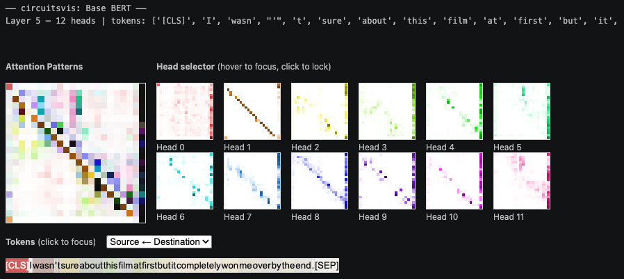
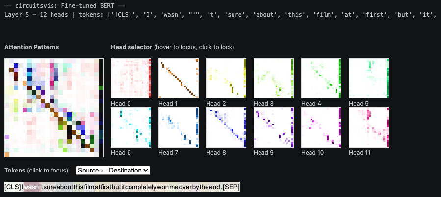
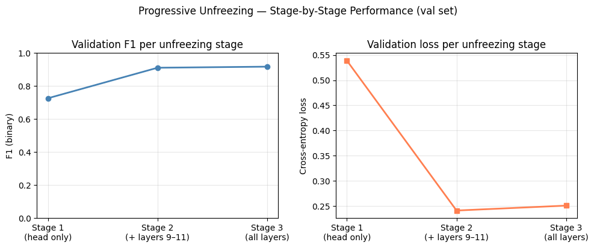

# Mini-Project-AML-2026
___
Group members:
* Astrid Arhnung Schou-Hanssen
* Ellen Hørlyck Ebdrup
* Emil Fuhr Nielsen
* Julie Tilling Niemann

## Finetune BERT for Downstream Tasks
___

The central problem of this project is implementing a pre-trained BERT model and explore extensions to improve upon baseline results in a sentiment analysis classifying the polarity of IMDb Movie.

The IMDb Movie dataset consist of two columns one with a text string with reviews and one binary class column with 0 being the negative and 1 the positive classification of the review. 

Dataset size
* Test: 25k rows
* Train: 22.5k rows
* Validation: 2.5k rows

In total 50k rows

### Pre-finetuning analysis with CLS token and mean-pooled token
___

We evaluate how much sentiment information is encoded in pretrained BERT by extracting hidden representations from each layer of BERT without finetuning and training a logsitic regression classifier on top.

We compare two representation strategiers: the [CLS] token and mean-pooked token embeddings. Performance is measured using accuracy and class-wise F1 scores across layers for both classes. 

For the CLS token, we see that it quickly becomes informative after the first few layers and peaks at layer two but then saturates. This suggests that the CLS token doesn’t gain much additional task-specific information in deeper layers. We also observe a larger imbalance between the positive and negative class in the early layers, indicating that the representation is less stable and more biased before it converges.

In contrast, the mean-pooled embeddings start at a much stronger level and improve steadily across all layers, reaching their highest performance in the final layer. Here, the F1 scores for the positive and negative classes remain very similar across layers, suggesting a more balanced and robust representation. This indicates that task-relevant information is distributed across tokens and becomes more linearly separable deeper in the network.

Overall, this tells us that while the CLS token captures useful information early, the full representation continues to improve throughout the model and provides a more stable signal for classification.

### Finetuning
___

### Edge cases

Classsifying labels of test cases using the fine-tuned model achieves an accuracy of 0.916.

|                | Predicted Negative | Predicted Positive |
|----------------|-------------------|-------------------|
| True Negative  | 11455 (91.64%)    | 1045 (8.36%)      |
| True Positive  | 1050 (8.40%)      | 11450 (91.60%)    |

To furhter analyse the confidence of the model's predictions, we find the cases in the which the model was most confident in its classification, but the classification was wrong. 

Initially, we notice that the first 123 cases are false positive - indicating that the model struggles to identify negative cases. 

An assumption would be that there is a connection between misclassification and movie review length, but counting number of characters in the reviews is quite ambiguous. Among the misclassifications review length ranges from 61 to 12710 characters with a mean of 1617. 

Shortest false positive case (61 characters): "*More suspenseful, more subtle, much, much more disturbing....*"
Looking into how the [CLS] token attends to the tokens in the review for a random combination of head=5 and layer=5 and find that [CLS] strongly focusses on the semantic tokens '##spense', '.' (repeated 4 times), 'more' (repeated 3 times), 'disturbing', and '##ful' in which it confidently associates with being a positive review. This indicates that the model might struggle to capture the full meaning of the sentence - in this case this review sounds quite sarcastic. 

Shortest false negative case (157 characters): "*It's not Citizen Kane, but it does deliver. Cleavage, and lots of it. Badly acted and directed, poorly scripted. Who cares? I didn't watch it for the dialog.*"
Looking into how the [CLS] token attends to the tokens in the review for a random combination of head=5 and layer=5 and find that [CLS] strongly focusses on the semantic tokens 'does', 'poorly', and 'lots' where we would assume 'poorly' definitely associates with a negative review. Again the model fails to capture that this review is positive even though it contains some trash talk. 

To look into how model reacts/attends to spefic semantic tokens for a sentiment analysis, we created a function that given sentiment keywords, finds the head, layer combination that gives the highest attention scores to the keywords. 
___

### Attention matrix
___
Finally, we visualize attention distribution as interactive 2D heatmaps for the base- and finetuned model. We represent attention as 2D map, where $(ii,jj)$ indicates attition from $ii \rightarrow jj$. $\textit{Diagonal patterns}$ often indicate a focus on the token itself or nearby tokens. $\textit{Vertical stripes}$ indicate globally important tokens for sequence. $\textit{Horizontal stripes}$ indicate tokens with broad attention.

BERT has 12 layers, each layer containg 12 attention heads. We choose to visualize the attention heads for the first layer for BERT base using the $\textit{circuitviz}$ library. The chosen sentence is a negative sample. We observe for head 0-2 that attention weights is mostly scattered with no clear patterns. For head 3 there is a strong attention to the previous token. Head 4-11 seems to also be scattered but still have localized clusters of attention which might indicate positional or syntatic roles.

For comparison we include fine-tuned BERT for the same layer an review. There is no noticeable difference compared to the base model. This indicates that the fine-tuning have little effect on the first layer of the model.

For comparison we include visualization of attention heads for the fifth layer as we see performance stabilize at this level. We compare for both the base and finetuned BERT model. Here it is profound that Head 0 has scattered attention, but keeping strong attention to [SEP]. Head 1 has a strong diagonal representing each token attends to the one before it. Head 2-5 has more localized clusters, and Head 6-10 has strong attention diagonal attention while high attention to [SEP], represented by the vertical stripe in the last token.

For comparison we include the fine-tuned BERT model for the 5 layer. Here we see the same overall pattern. However, there heads seem to generally have more specific attendance to tokens capturing more of the semantic and context based meaning meaning. For example, Head 10 and 11 has much higher attention to this --> film for the finetuned model compared to the base model. This captures that the model has captured the context of the training data.

Broadly, we observe that the finetuned model attention shifht from being broadly distributed patterns to into more specific attention weights. The [CLS] token highly attens to the [SEP] for later layers which is a known phenomenon called $\textbf{attention sink}$, meaning the model dumps spare attention rather than spreading it across the sentence. This is already known in litterate from the paper $\textbf{What Does BERT Look At?}$ which observeres that later heads attends heaviely to [SEP].

### Progressive Unfreezing 

Motivated by the analysis above, which shows that sentiment information becomes linearly separable from layer ~5 and onwards, we explore whether its necessary to fine-tune all layers simultaneously. 
Fine-tuning all the layers at once might risk large gradients from the randomylt-initialized head corruptiing the useful lower-layer encoder representations (catastrophic forgetting). 

We apply progressive unfreezing (ULMFiT - Howard & Ruder, 2018), training in three stages over three epochs:

| Stage	| Epoch	| Trainable parameters	| Val F1	| Val Loss | 
|----------------|-------------------|-------------------|-------------------|-------------------|
|   1	| 1 | 	Classifier head only	| 0.726	| 0.539 |
| 2	| 2 |	Head + top 3 encoder layers (9–11)	| 0.911	| 0.241 | 
| 3	| 3	|   All layers	            | 0.918	| 0.251 | 

Test set: Accuracy 91.86% - F1 0.9185

As we can see below, the largest gain occurs between stage 1 and stage 2, confirming that the top encoder layers carry the most task-relevant information and adapt quickly when unfrozen. Stage 3 only adds a marginal improvement, which might suggest that the bottom layers contribute relatively little to sentiment classification. The slight increase in loss we see from stage 2-3 indicates mild overfitting once all layers are unfrozen. 

